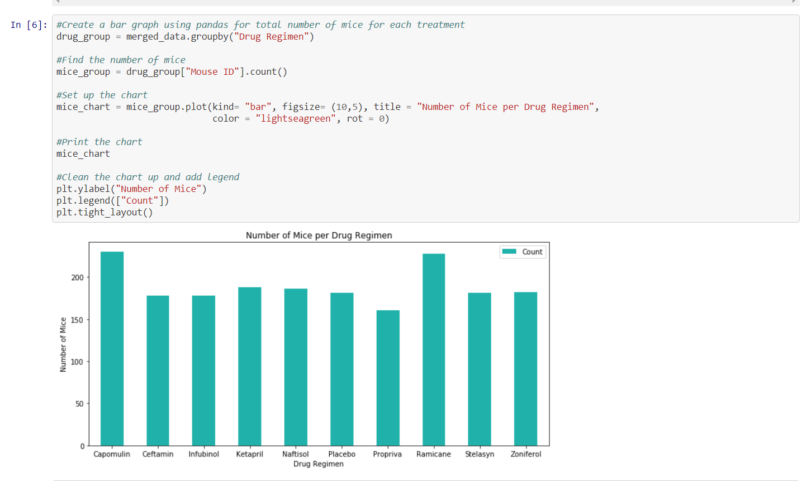

# Matplotlib-Challenge

To work on this challenge, I used a combination of Python, Jupyter Notebook, Pandas, and Matplotlib to:

1. Clean the data provided about tumors in mice and the drug regimen they were on. 

2. Create bar charts, pie charts, line graphs, box and whiskers charts, and scatter plots to display the data.

3. Used these charts to show the differences each drug had on the tumors in mice. 

